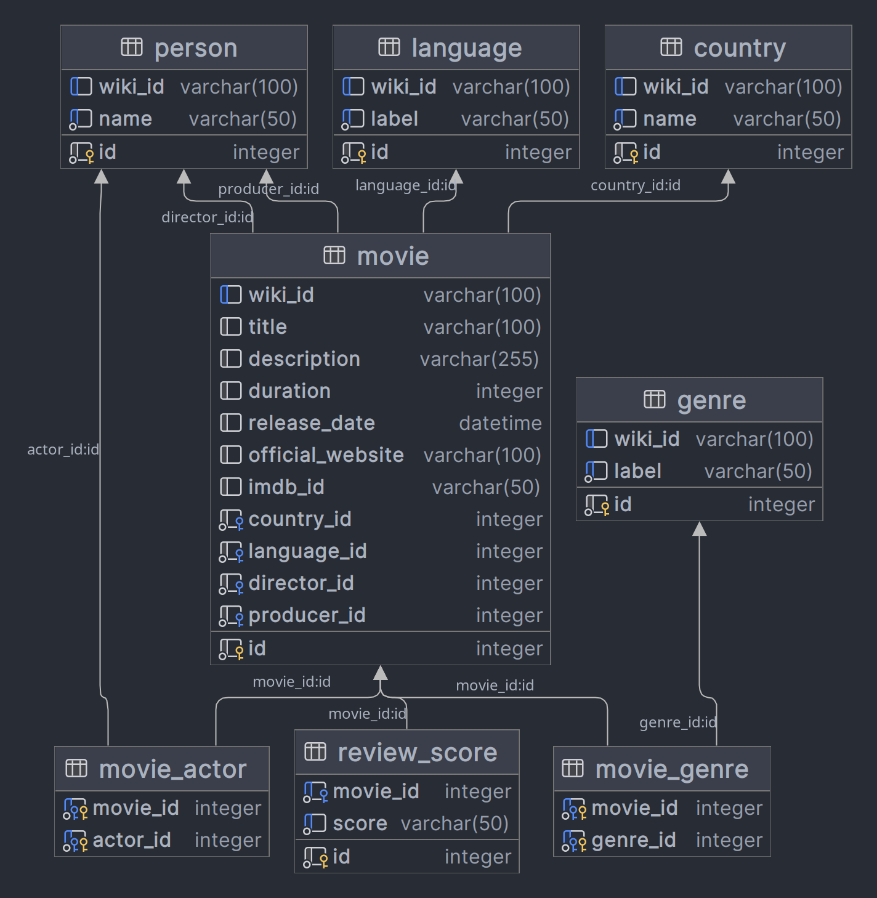

# Mini Data Ingestion

## Requirements

- `Docker`
- `docker-compose`

## Setup

1.Clone repository
```shell
git clone git@github.com:ichux/mini-data-ingestion.git
cd mini-data-ingestion
```

2.. Launch `docker-compose`
Use a .env to configure the app port(default: 8000) if needed. In that case, `cp .env.example .env`

```shell
make b
```

## Usage
Your app will be available at `127.0.0.1:8000` or the port you've selected while starting it.

> Use the command `make a` to create an admin user to access the data. The default `username/password` = `(admin/admin)`

## Design Decision
Below is a graph of the SQL architecture employed:



The tables are modeled after the fields retrieved from [https://query.wikidata.org/sparql](https://query.wikidata.org/sparql).
You can view the SPARQL query used [here](mdi/query.sparql).

SPARQL conceptualize the data as a labeled graph. The data returned from the query service contains duplicated fields along with unique values. For instance, we might get the same movie two or more times, with only the `castMember` being different each time.

To ensure uniqueness, an UPSERT is performed to load the data. The uniqueness of the item id (from Wikidata) serves as a mark to update the existing records when necessary.